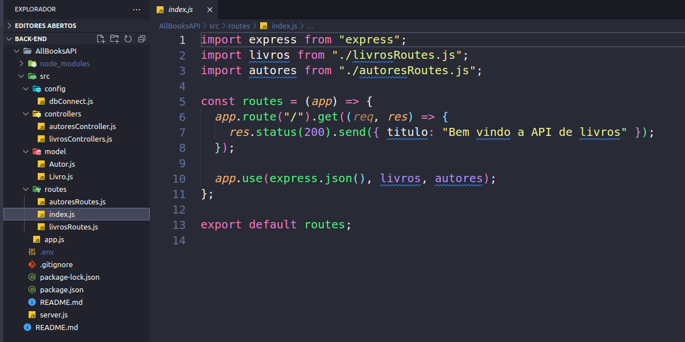
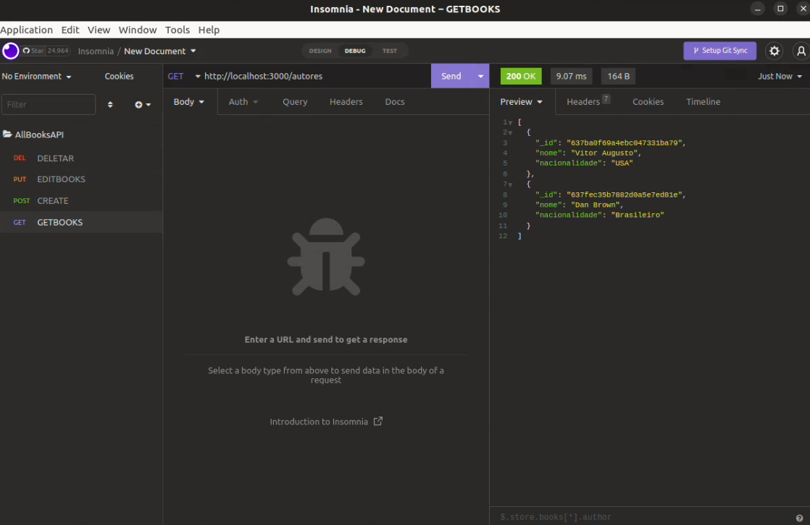
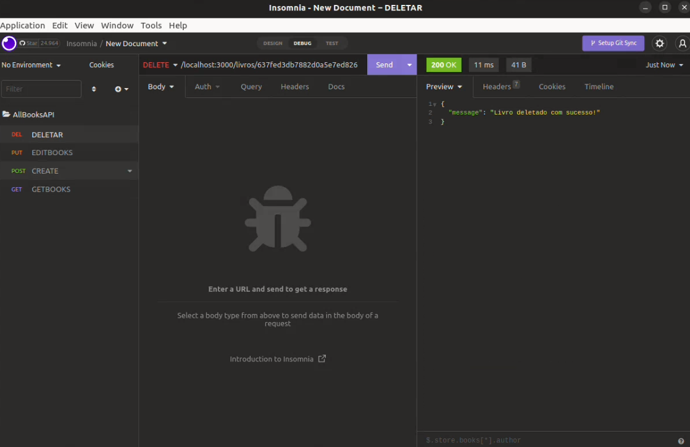
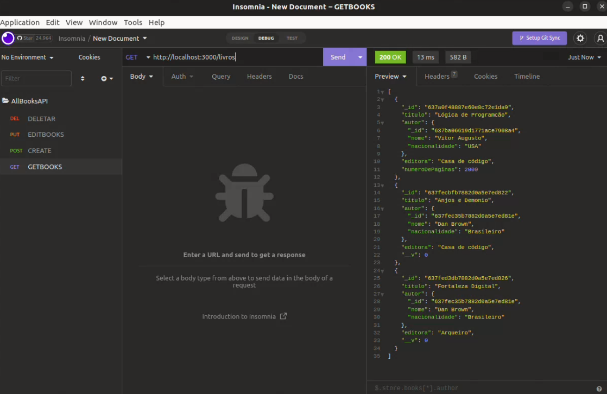

<h1 align="center"><a href="#"> 💻 Projeto API de Livros</a></h1>

<p align="center">
Projeto API livros é uma API REST. para cadastrar recursos como livros, autores.

</p>

<p align="center">
  <a href="#-tecnologias">Tecnologias</a>&nbsp;&nbsp;&nbsp;|&nbsp;&nbsp;&nbsp;
  <a href="#-projeto">Projeto</a>&nbsp;&nbsp;&nbsp;|&nbsp;&nbsp;&nbsp;
  <a href="#memo-licença">Licença</a>
  
</p>

<p align="center">
  
</p>

<br>

<p align="center">
  
</p>

<p align="center">
  
</p>

<p align="center">
  
</p>
<p align="center">
  
</p>

## 🛠️ Tecnologias/ Ferramentas

Esse projeto foi desenvolvido com as seguintes tecnologias:

- [JavaScript](https://developer.mozilla.org/pt-BR/docs/Web/JavaScript)
- [Node.Js e NPM](https://nodejs.org/)
- [Express.Js](https://expressjs.com/pt-br/)
- [nodemon](https://www.npmjs.com/package/nodemon)
- [mongoose.Js](https://mongoosejs.com/)
- [MongoDB](https://www.mongodb.com/atlas/database)
- [Dotenv](https://www.npmjs.com/package/dotenv) 
- [Insomnia](https://insomnia.rest/)


## 📃 Projeto

Projeto API livros é uma API REST. para cadastrar recursos como livros, autores, usando as boas práticas aqui de dividir os pacotes em controlador, em models, em rotas. Utilizando os verbos HTTP para buscar corretamente os livros, cadastrar, atualizar e excluir e dessa forma fecho  CRUD, fiz o CRUD completo acessando dados diretamente no banco, fazendo a conexão com o banco.

## ⚙️ Como executar 


Você precisa ter instalado as seguintes ferramentas: Node.js, Insomnia.

Será necessário que a porta 3000  estejam disponíveis para a aplicação.

1 - Clone o repositório em uma pasta de sua preferencia 
```
git@github.com:ViitorAugusto/Back-End.git
```
2 - Entre na pasta `AllBooksAPI`
```
npm install  // todas as depêndencias serão automaticamente instaladas.
```
3 - Use o comando
```
npm start // para inicar a aplicação
```


3 - Após rodar o comando, aguarde um pouco que a aplicação irá ficar disponivel nas seguintes rotas:


  `- Back End: http://localhost:3000`


## 🚀 memo: Licença

Esse projeto está sob a licença MIT.

---

Feito por Vitor Augusto [Linkedlin.](https://www.linkedin.com/in/viitoraugusto/)


