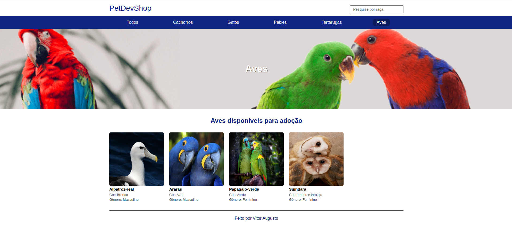
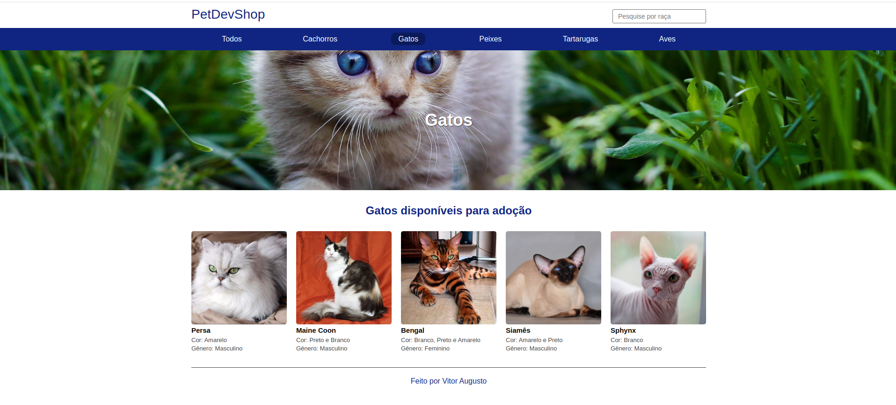
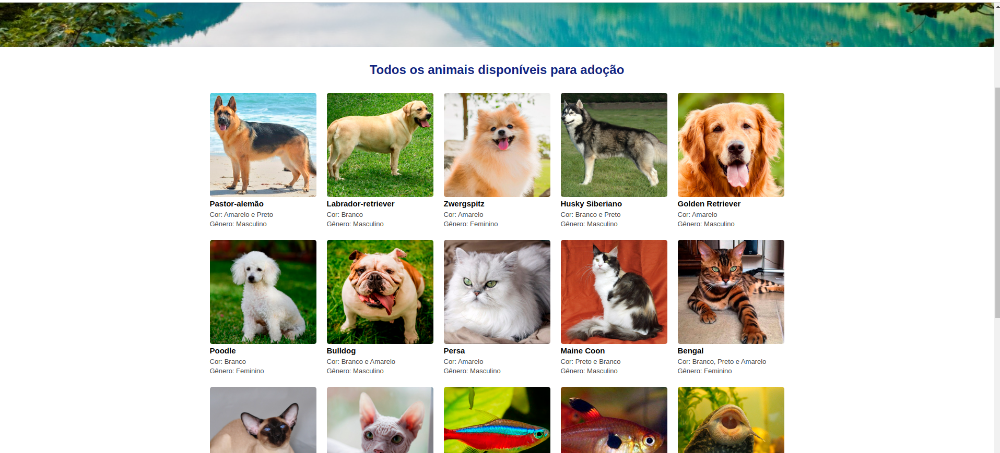

<h1 align="center"><a href="#"> 💻 Projeto Canil</a></h1>

<p align="center">
Canil é uma página de busca por ADOÇÃO .

</p>

<p align="center">
  <a href="#-tecnologias">Tecnologias</a>&nbsp;&nbsp;&nbsp;|&nbsp;&nbsp;&nbsp;
  <a href="#-projeto">Projeto</a>&nbsp;&nbsp;&nbsp;|&nbsp;&nbsp;&nbsp;
  <a href="#memo-licença">Licença</a>
  
</p>

<p align="center">
  
</p>

<br>

<p align="center">
  
</p>
<br>
<p align="center">
  
</p>
<br>
<p align="center">
  
</p>


## 🛠️ Tecnologias/ Ferramentas

Esse projeto foi desenvolvido com as seguintes tecnologias:

- [TypeScript](https://www.typescriptlang.org/)
- [Node.Js e NPM](https://nodejs.org/)
- [Express.Js](https://expressjs.com/pt-br/)
- [Nodemon](https://www.npmjs.com/package/nodemon)
- [Dotenv](https://www.npmjs.com/package/dotenv) 
- [Mustache](https://www.npmjs.com/package/mustache-express)
- [types/node](https://www.npmjs.com/package/@types/node)

## 📃 Projeto

O projeto de canil para adoção pode ser uma iniciativa muito importante para promover a responsabilidade animal e ajudar a encontrar lares responsáveis para cães que foram abandonados ou estão sem lar. Iniciar um projeto de canil para adoção pode ser um desafio, mas pode ser muito gratificante ajudar a encontrar lares responsáveis para cães que precisam de um lar.

## ⚙️ Como executar 

### Pré-requistos globais: 


```npm i -g nodemon typescript ts-node```


### Para rodar o projeto


Será necessário que a porta 3000  estejam disponíveis para a aplicação.

1 - Clone o repositório em uma pasta de sua preferencia 
```
git@github.com:ViitorAugusto/Back-End.git
```
2 - Entre na pasta `ProjetoCanil`
```
npm install  // todas as depêndencias serão automaticamente instaladas.
```
3 - Use o comando
```
npm run start-dev// para inicar a aplicação
```


3 - Após rodar o comando, aguarde um pouco que a aplicação irá ficar disponivel nas seguintes rotas:


  `- Back End: http://localhost:3000`

<br>
<br>
<hr>
## 🚀 memo: Licença

Esse projeto está sob a licença MIT.

---

Feito por Vitor Augusto  [ 🌐 Linkedlin.](https://www.linkedin.com/in/viitoraugusto/)


